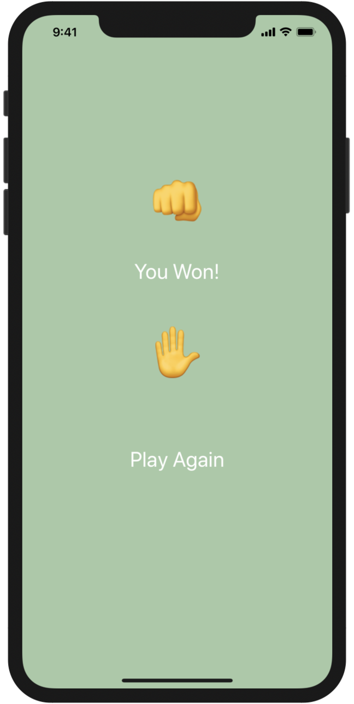

# UC-SuperStudent-1

في هذا التمرين سوف تحظى بالمتعة والمرح من خلال صنعك لعبة حجر ورقة مقص .
اليك بعض المساعدة :
سوف تستخدم :
1. image widget
2. button widget
3. صفحة تختار منها طريقة اللعب اما مع الكمبيوتر او مع صديق
4. صفحة لاختيارك ثم الانتقال 
5. function تشتغل عند الضغط على الزر 

